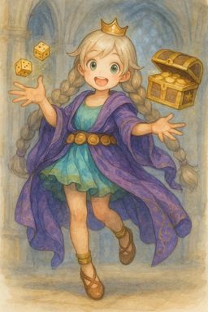
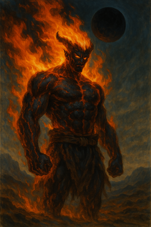
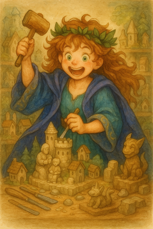
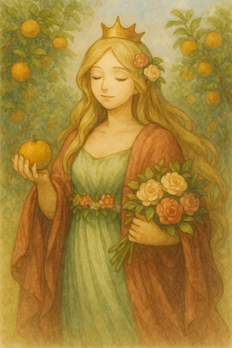
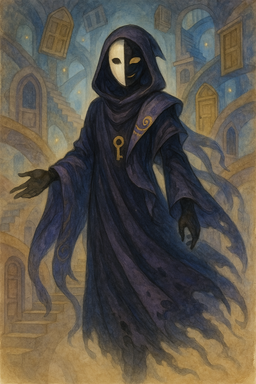

# 神々と信仰

## 確率を司る神メルツ

**異名** : 周期をもつ可能性の調律者

### 教会

いくつもの街や村に教会があり、女神メルツ様が降臨される日は参拝者が増える。それは、特別なお布施とお返しこと **くじ宝** の日だからだ。

くじ宝では、お布施の額に応じて、宝箱からランダムなアイテムが授けられる。それを楽しみにしている人は多い。

教会は、質素なものから街ならほとほと豪華なもの。ただし、いずれも大きな鐘がついている。

裏には、研究所があり、買い取ったくじ宝のアイテムの整理や研究をしている。

くじ宝のアイテムは、ゴミから超一品の秘宝や魔道具と様々で、特急品が出たら大きな鐘が鳴らされ、オークションが開催される。多くの場合は、そのままメルツ教会が買い取っている。

このくじ宝の研究成果は、各国に様々な貢献をしており、それは生活から軍事と幅広く、国家との技術的なつながりも強い。

ただし、どの国家も認めているわけではなく、賭博だ依存症を生むだのとメルツ教を禁止している国もある。

また、大きな教会では、数学や統計学について教えている。

### 信仰と階層や役割

信徒はくじ宝を通して女神とつながりを得るとされ、信仰の深さに応じて階層が分かれている。

#### 初級信徒

一般信徒、礼拝者。くじ宝に参加したり、お祭りに参加する。

#### 中級信徒

熱心な信徒であり、廃課金者。くじ宝に稼ぎのほとんどを使う。

#### 上級信徒

司祭、神官として、運営者になった者。数学、統計学に精通し、くじ宝を分析し、ミクロな視点、マクロな視点から観察、理解し、個人がやるものではないと判断に至れし者。

#### 研究者

くじ宝の超一品や一品を管理し、それらがどういうものか管理、研究する。また、超一品かどうかなどの鑑定も行うため、かなりの知識と魔道技術力が必要である。

### 祈りの形式

ダイスを振る、カードをシャッフルして一枚めくるなどの偶然からの結果を一喜一憂、または読み取る行為を行う

### 教義・掟

変わることを恐れるなかれ

全てのものに波がある

### 禁忌

絶対を語ること

ゲームや賭博、勝負事でズルをすること

### 儀式

メルセンヌ数を暗唱する

### 教会での得点

ランダムに、あてになるかもしれないお告げを聞くことができる

お告げの内容次第では、次の行為判定で振り直しが1回許されることもある。

### 信仰による行動指針

悩んだら、魂のダイスに全てを賭けて熱狂に身をゆだねよ

## 秩序を司る神ノルゼアス

**異名** : 因果を律する永律の審問官

### 教会

ノルゼアス教会は、都市の中核や行政機関と一体化して設けられることが多く、左右対称かつ幾何学的な構造を持つ建造物である。中央には円環状の聖堂があり、祭壇や座席も厳密なルールに従って配置されている。

教会建築に用いる寸法はすべて神聖なる基準寸「ノル基（ノルスケール）」に従い、全ての物差しはそこから生まれる。

内部では、 **秩序の学問（法学・倫理・記録術・測量・天文）** が教えられており、学術機関としての側面も持つ。

場所によっては裁判所として機能しているところもある。

### 信仰と階層や役割

信徒の階級は厳格に定められており、記録と試験により明確に区分される。

#### 初級信徒（律者）

毎朝・毎夕の礼拝を欠かさず、日々の生活を定められた律に従って生きる者たち。
儀式への参加権を持ち、月に1度、倫理講義を受講することが求められる。
#### 中級信徒（記録者）

律を超えて、他者を導く者。記録と観察の義務を持ち、教会内外の行動を日誌に記す。
他者の行為を定量化し、秩序に反する動きを報告する役割も担う。

#### 上級信徒（審問官／秩序騎士）

教会における裁定を下す者。教義を体現し、争いを理によって収束させる。
裁定には必ず「三者合議」が行われ、独断は最も忌避される。

また、髪型、体系、背丈、表情、などあらゆる揃えられるものは均一にすることが義務とされている。同じであれば、同じ服や道具が使える、素晴らしいことだ。

#### 裁判官

各所の裁判官を任せられることがある。

### 祈りの形式

手を左右対称に合わせて「円」の形を形作り、沈黙の中で律文を唱える

### 教義・掟

個は全に従い、全は秩序に従うべし

曖昧なものは白か黒に決めるべし

### 禁忌

偶然に頼ること

習慣を乱すこと

### 儀式

秩序の昇階儀式 : 記録と判定による試験を通して階級昇格が行われる

律文の朗唱会 : 百人の信徒が同時に律文を唱える神聖な日

### 教会での得点

その街、国の法や行事を教えてもらえる。

GMが許可し、指定する金額を支払えば、街の記録について知ることができる。ただしその記録から読み取れるかは調査などの判定が必要かもしれない。

### 信仰による行動指針

固定値こそ正義である

## 破壊を司る神ヴァルグ

**異名** : 終焉を抱く烈火の浄化者

### 教会

ヴァルグ教会は場所を規定しない。野原、荒地、広場、どこでも教会となりえる。

そもそも、わざわざ建物を作るなどということこそおかしいと考えるからだ。破壊の先に祝福がある。なればこそ、教会という施設は不要であり、彼らは定められた場所に集まる。

国家や領主によっては、この教会を反体制的で危険と見なしており、信仰が禁じられている国も存在する。

### 信仰と階層や役割

信仰は一貫して「破壊し、終わりを受け入れること」に向けられている。

#### 初級信徒（焔呼び）

日々の祈りの中で、怒りや執着を燃やすことを意識する。
破壊を「必要な浄化」と捉える者たち。身にまとう装束は布一枚ということもある。

#### 中級信徒（灰の導師）

破壊の正義を語る教導者。焚火の中で説法し、絶望の中に光を見出させる。
廃墟があれば率先して壊しに行く。火事になれば周囲の民家をつぶすのも、大事にしないために必要な彼らの仕事だ。

#### 上級信徒（戦火の預言者）

武力をもって破壊を導く者。剣に誓いを立てた騎士・戦士・処刑人などが多く、秩序なき暴力とは異なり、「意味ある破壊」の遂行者として重んじられる。

#### 討伐官

魔物や盗賊などの盗伐を任せられる専門の役職。

### 祈りの形式

薪に火を灯し、静かにその炎が燃え尽きるのを見守る。

### 教義・掟

すべてのものはいつか壊れる

死は破壊の一つであり恐れることはない

### 禁忌

借金をすること

死体を冒涜する行為

### 儀式

焔送り : 使い終えた武具、想い出の品などを火にくべる浄化の儀式

塔崩しの祭り : 古びた建築物をあえて壊す祭典。

### 教会での得点

荒地や平原で訓練している信徒がいるかもしれない。

彼らの協力により修行することで、GMの許可に基づいて、1セッションに1シーンだけ、与えるダメージを+1Dしてもよい。

### 信仰による行動指針

壊すことを恐れるな

## 創造を司る神ファレンシア

**異名** : 終わりなき造形の母

### 教会

ファレンシア教会は、工房と教会が融合した施設であることが多く、「教会」ではなく「創殿（そうでん）」と呼ばれる。

堂内には祭壇と並んで、粘土細工や彫刻、建築模型、魔道具、絵画などが所狭しと並び、しばしば創作の混沌と静寂の崇高さが同居しているような空間となる。

壁や天井は、日々信徒たちによって塗り替えられ、装飾や構造も改修が繰り返されるため、毎日形が変わる教会もある。まさに“生きた建築物”である。

ファレンシアの神像は一定の姿を持たず、地域や職人の思想によって毎度異なる「創作品」が奉納される。中には、逆さ吊りになった金属像や、自走する神像まで存在する。

建築、立体造形だけではなく、兵器、生物の創造、研究にも余念がない。そのため、国家と軍事的なつながりを持つ。

### 信仰と階層や役割

#### 初級信徒（創種子）

日々、小さな創作を続ける者たち。信仰において **「失敗もまた創造の一部」** とされ、未完成の作品でも「芽吹きの証」として尊重される。

#### 中級信徒（工霊導師）

創殿の管理や指導に携わる。特定のジャンル（彫刻、機械、魔道具、料理など）に長けており、**“創造の導き手”**として他者の創作をサポートする。

#### 上級信徒（形神工）

もはや創作の域を越え、新たな命や思想を創り出す者たち。しばしば常識外れの作品を生み出し、社会的に問題視されることもあるが、ファレンシア教会内では「神の望みに近づいた」として賞賛される。

#### 創命師

軍事兵器および、魔法生物などの研究を行っている。

### 祈りの形式

杖でも木の枝でもよい、地面に何かを書き記す。それが祈りの在り方だ。

### 教義・掟

とにかく作れ、無駄なものなど何一つない

創作は模倣から始まる

### 禁忌

ない、なぜならすべては創作につながるのだから

### 儀式

献作式：信徒が自作の創造物を奉納する儀式。

### 教会での得点

工房があり、そこで創作すると判定を1回振りなおすことができる。

### 信仰による行動指針

思いついたなら、まず形にせよ。

## 愛と恵を司る神リュナー

**異名** : 祝福をまとう万華の抱擁者

### 教会

リュナーの教会は「春の園」と呼ばれ、花咲く庭園や果樹園の中に建てられることが多い。温室のような教会や、野外に簡素な祭壇だけがある場所もあり、構造は自由で開放的。

堂内には花や果実が飾られ、季節ごとの収穫物や手料理を供えるのが一般的な祈りの形。中には、恋人や家族の手紙、愛の記録を奉納する信者もいる。

教会では定期的に「祝祭」が催され、歌や踊り、詩の朗読などが行われる。結婚式や出産の報告など、人生の節目の祝福の場としての役割も強い。

教会には必ず別館があり、 **花の館** などと呼ばれている。大人の女性が勤めている。

### 信仰と階層や役割

リュナーの信仰は、個人の情熱・絆・豊かさに根ざしており、しばしば「家族の神」「恋愛の神」「商人の神」など、多面的に信仰されている。

#### 初級信徒（花摘み手）

日々の感謝を祈り、贈り物や食事を分け合う者たち。
誰かを愛し、支え、祝福することこそ信仰とされる。

#### 中級信徒（祝祭人）

祝祭の場を仕切り、人々の喜びを演出する者たち。
詩人、芸人、花職人、酒場の主などが多く、人々の心と心を結ぶ。

#### 上級信徒（抱擁の賢者）

愛の導師、または豊穣の守り手。心の傷を癒す者、分かち合いを教える者として地域に根ざす。

#### 花の売り子

**花の館** で勤める女性。まれに男性もいる。

### 祈りの形式

思いをつづった手紙を書く。相手に渡さなくてもよい。

### 教義・掟

愛も恵みも、巡り巡って自分に返ってくる

愛は戦いである

己もまた愛すべし

### 禁忌

自分を犠牲にすること

### 儀式

芽吹きの祈り：春の訪れに捧げる歌と花の舞い。恋人同士で行うと祝福されるという。

### 教会での得点

**花の館** は500Gで利用できる。利用することで、興奮、熱中、穏やか、喜びで持っている感情タグの演出ロールに成功したものとして扱ってもよい。GMは悲しみも成功したとしてもよいし、その他、SP3点などの消費などを指定してもよい。

### 信仰による行動指針

人を愛し、信じよ。

## 迷宮を司る準神ニャラ・ネス

**異名** : 終わりなき分岐に誘う者

### 教会

迷宮そのものが教会であるが、その迷宮の管理協会があり、実質的にはそれがニャラ・ネスの教会にあたるといえるだろう。

冒険者、挑戦者も集うため、信徒が誰なのかは分かりにくい。

迷宮が何のためにあるのか、出現するのかは分かっておらず、各国が調査をしている。

そのため、国が接収し、他者の立ち入りを禁止して調査されている迷宮も存在する。

### 信仰と階層や役割

ニャラ・ネスの信仰は神格ではなく概念への信仰に近く、信徒の姿勢も多様である。

#### 初級信徒（巡り人）

迷宮へ心惹かれ入り、先へと進もうとする者。

#### 中級信徒（挑戦者）

迷宮に挑み、さらに奥へ、新たな敵と財宝を夢見て進む者。

#### 上級信徒（管理者）

迷宮の管理を任されしもの。誰が入ったか、死んだか、どんな財宝があったか、魔物は、などの記録をとり、その他の仲介を行う。

### 祈りの形式

目をつぶって、くるりと回って一歩進む。

### 教義・掟

不明

### 禁忌

不明

### 儀式

不明

### 教会での得点

特にない

### 信仰による行動指針

選択と挑戦を恐れるな